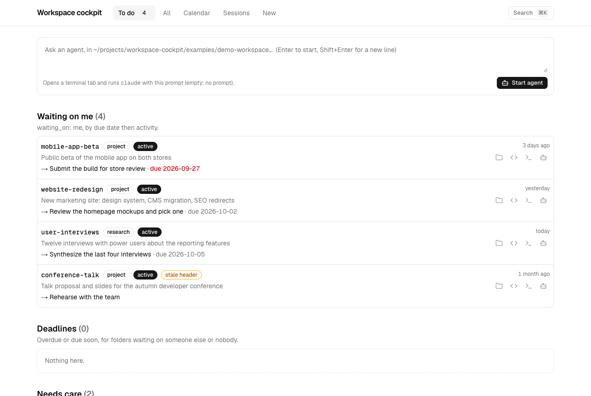
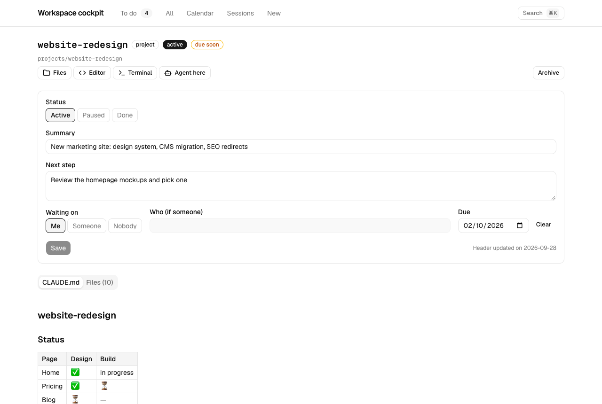
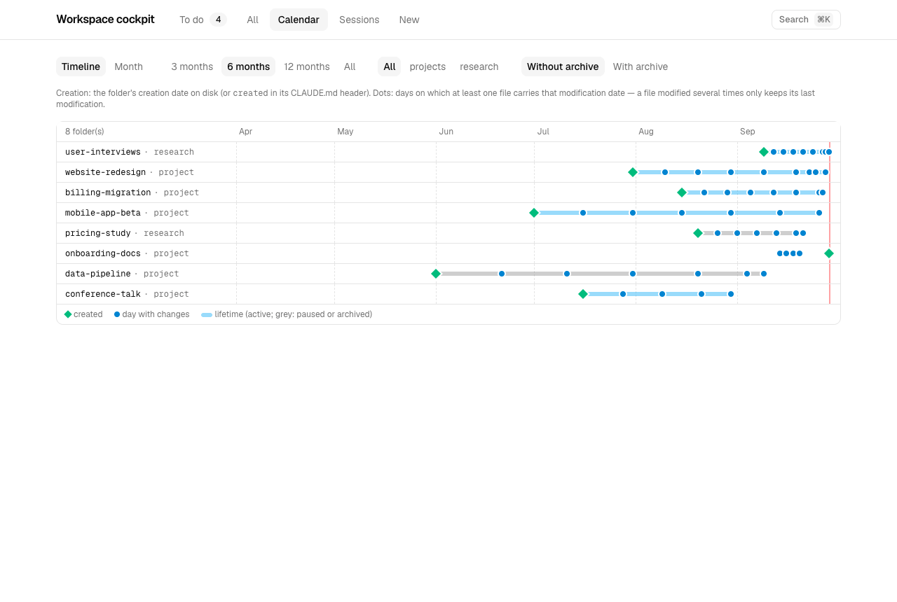
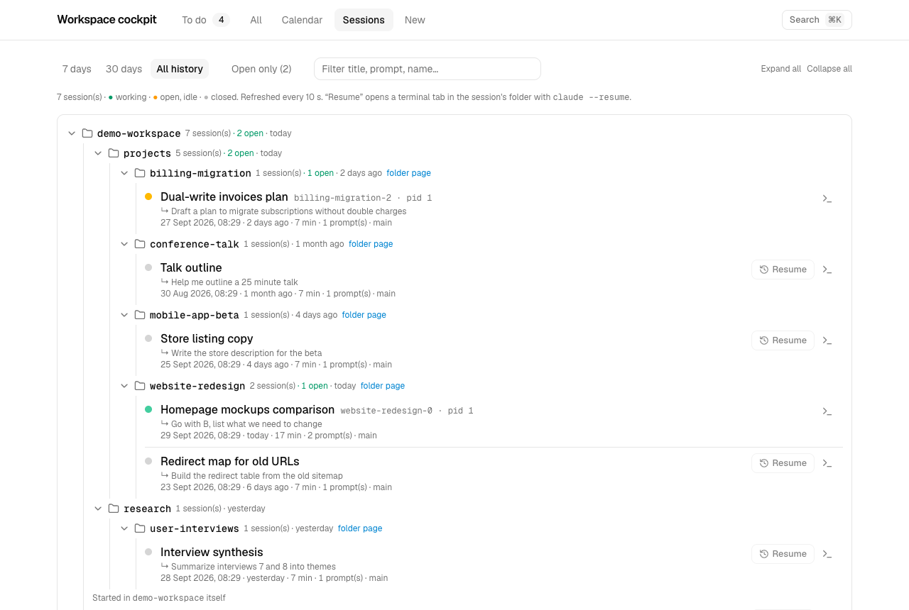
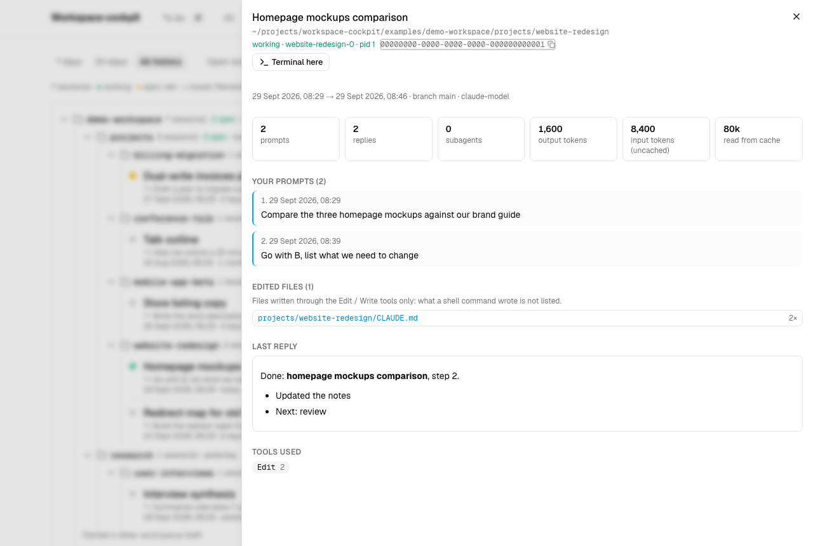

# workspace-cockpit

A local dashboard for a folder full of projects — and for the Claude Code sessions you run in it.

Each project folder carries a tiny header at the top of a Markdown file (`CLAUDE.md` by default): its status,
a one-line summary, the next step, who has the ball and when it is due. The cockpit reads those headers and
shows you, in one page, **what is waiting on you**, what is late, and what has gone quiet. It also lists every
Claude Code session started anywhere in the folder, laid out like the folder tree, and lets you resume one in
a terminal with a click.

Everything stays on your machine: the web server listens on `127.0.0.1` only, the data is your files, and
Claude Code transcripts are read, never written.



## What you get

- **To do** — folders waiting on you (by due date), deadlines owned by someone else, and folders whose header
  is missing, invalid or stale. A prompt box starts an agent in a new terminal tab.
- **Inbox** — on top of the To do page, small to-dos that do not deserve a folder (see [Inbox](#inbox)).
- **All** — every tracked folder, filterable by collection, status, owner and alerts.
- **Folder page** — edit the header in a form (only the header block is rewritten, the rest of the file is kept
  byte for byte), read the Markdown, browse and preview files (Markdown, HTML reports in a sandbox, PDF, CSV,
  images, text), archive or unarchive, open the folder in Finder, your editor, a terminal, or an agent. A prompt
  box starts an agent in the folder; **Email reply** prefills it with "file this email in the notes, update the
  header, draft a reply", so you only paste the email.
- **Search** (⌘K) — jump to a folder, or search inside the text files of every folder, accents ignored.
- **Calendar** — a timeline (creation → last activity, one dot per day with changes) and a month grid.
- **Sessions** — every Claude Code session started under the workspace, as a tree of folders, with a live
  status (working / open / closed). Click one for its prompts, edited files, GitHub links, token usage and
  last reply; resume a closed one with `claude --resume` in a new terminal tab.

| Folder page | Calendar |
|---|---|
|  |  |
| **Sessions** | **Session detail** |
|  |  |

## Requirements

- Python 3.11+ (standard library only)
- Node.js 20.9+
- macOS for the "open in editor / terminal / agent" buttons (iTerm or Terminal.app). Everything else works on
  Linux too; set `terminal = "none"` and `editor_app = ""` there.

## Try the demo

```bash
git clone <this repository> workspace-cockpit && cd workspace-cockpit
python3 examples/make-demo.py        # a fictional workspace + fictional Claude Code sessions
CLAUDE_CONFIG_DIR=$PWD/examples/demo-claude bin/cockpit start --config examples/demo-workspace/cockpit.toml
```

The first start installs the web dependencies and builds the app (a minute or two); then it opens
<http://127.0.0.1:8767>.

## Use it on your own folder

1. Copy [`cockpit.example.toml`](cockpit.example.toml) to the folder you want to track, as `cockpit.toml`, and
   list your collections (the subfolders that contain one folder per project).
2. From that folder, run `path/to/workspace-cockpit/bin/cockpit start` (or pass `--config path/to/cockpit.toml`;
   `start` needs a config file, the other commands fall back to defaults rooted at the current folder).

A layout like this one:

```
work/
  cockpit.toml
  projects/
    website-redesign/CLAUDE.md
    billing-migration/CLAUDE.md
    _archive/2025/legacy-api-shutdown/
  research/
    user-interviews/CLAUDE.md
```

is described by:

```toml
collections = [ { dir = "projects", label = "project" }, { dir = "research", label = "research" } ]
```

## Start at login (macOS)

```bash
cd ~/work && path/to/workspace-cockpit/bin/cockpit install
```

- A LaunchAgent (`~/Library/LaunchAgents/workspace-cockpit.plist`) starts the cockpit at every login, without
  opening the browser, and restarts it only if it crashes. Logs: `~/Library/Logs/workspace-cockpit.log`.
- A **Workspace Cockpit** app in `~/Applications` (Spotlight, Dock) opens the page — and starts the server first
  when it is down.
- `bin/cockpit open` does the same from a terminal; `bin/cockpit uninstall` removes both.

The LaunchAgent remembers the Python, Node.js and config paths found at install time: run `install` again after
moving the repository or changing Node.js versions.

## The header

At the very top of each folder's `CLAUDE.md` (or the file set by `header_file`), one `key: value` per line:

```yaml
---
status: active            # active | paused | done
summary: New marketing site: design system, CMS migration, SEO redirects
next_step: Review the homepage mockups and pick one
waiting_on: me            # me | someone | nobody
who: Design agency        # when waiting_on is someone
due: 2026-10-05           # YYYY-MM-DD, optional
updated: 2026-09-28       # set automatically on every change made through the cockpit
created: 2026-03-15       # optional: overrides the folder's creation date on disk
---
```

`status` and `summary` are required; everything else is optional. Unknown keys are kept as they are. A folder
without a header still shows up, flagged "no status". Since the header lives in `CLAUDE.md`, Claude Code reads
it at the start of every session — a good place to ask it, in your own instructions, to keep `next_step`,
`waiting_on` and `due` up to date when a session ends.

## Inbox

Small things — a call to make, a setting to check, an idea — go to `INBOX.md` at the workspace root (the
`inbox_file` key), a plain Markdown checklist shown on top of the To do page:

```markdown
## To do

- [ ] 2026-09-29 · Renew the domain name

## Done

- [x] 2026-09-25 → 2026-09-28 · Share the Q3 numbers
```

Type and press Enter to add one; tick it to move it to Done; delete it, or turn it into a folder when it grows
(its text becomes the summary). The file stays yours: lines you write by hand, with or without dates, and any
other text are kept. Actions name a to-do by its rank and the text expected there, so an action on a file edited
in the meantime is refused rather than applied to the wrong line. Tell Claude Code about it in your
instructions and "remind me to…" lands there too.

## Command line

Every action of the web UI is also a JSON command:

```bash
bin/cockpit list                                   # all tracked folders
bin/cockpit show projects/website-redesign        # one folder and its files
bin/cockpit header projects/website-redesign --set next_step="Ship it" --set waiting_on=someone --set who=QA
bin/cockpit new projects mobile-app --summary "Public beta on both stores"
bin/cockpit archive projects/website-redesign     # status done + move to projects/_archive/<year>/
bin/cockpit search "redirect"
bin/cockpit calendar
bin/cockpit sessions                               # Claude Code sessions under the workspace
bin/cockpit session <session-id>
bin/cockpit todo add "Renew the domain name"     # inbox; also: todo, todo done|undo|delete N,
                                                   #   todo promote N <name> [--collection research]
bin/cockpit index                                  # write INDEX.md, a Markdown map of the workspace
bin/cockpit install | uninstall | open             # macOS: start at login, "Workspace Cockpit" app
```

## Configuration

See [`cockpit.example.toml`](cockpit.example.toml): tracked collections, archive folder, header file, "stale"
and "due soon" thresholds, terminal (`iterm`, `terminal`, `none`), editor app, the agent command
(`claude` by default — e.g. `claude --model opus`), port, the inbox file, and whether `INDEX.md` is rewritten after every change.

The config file is found through `--config`, then `$COCKPIT_CONFIG`, then `./cockpit.toml`.
Claude Code's data is read from `$CLAUDE_CONFIG_DIR`, else `~/.claude`.

## How it works

- `cockpit/` — a Python package with all the rules: reading and writing headers, the inventory, alerts,
  archive, search, calendar, and reading Claude Code transcripts (`<claude>/projects/*/*.jsonl`) and open sessions
  (`<claude>/sessions/*.json`, kept only when the process is alive). A small cache in
  `~/.cache/workspace-cockpit/` avoids re-reading unchanged transcripts.
- `web/` — a Next.js app that only displays and triggers: it calls the Python CLI for every read and write.
- `bin/cockpit` — starts the web app (install and build on demand) or forwards to the CLI.

### Safety

- The server binds to `127.0.0.1` and refuses any other `Host` header (DNS-rebinding guard); server actions
  check the request origin.
- Only folders listed by the CLI can be opened or served; files are resolved with `realpath` and must stay inside
  their folder. HTML and SVG files are served with a `sandbox` Content-Security-Policy.
- Terminal commands go through AppleScript: the folder and the prompt are passed as arguments and shell-quoted
  with `quoted form of` before being typed in the terminal tab, never spliced into the script itself.
  `agent_command` is typed as is — it comes from your own config file.
- Nothing is ever deleted: archiving moves a folder, and the cockpit refuses to overwrite an existing one.

### Known limits

- "Edited files" in a session only lists files written through Claude Code's Edit/Write tools, not by shell commands.
- The calendar's activity days come from file modification dates: a file modified several times only counts
  on its last modification.
- The open buttons are macOS-only.
- The sessions cache (`~/.cache/workspace-cockpit/sessions.json`) keeps a short excerpt of the first and last
  prompts of every Claude Code session on the machine, including those outside the workspace. Delete it at will.

## Development

```bash
python3 -m pytest tests          # Python tests
cd web && npm install && npm test && npm run typecheck && npm run lint
```

## License

[MIT](LICENSE)
